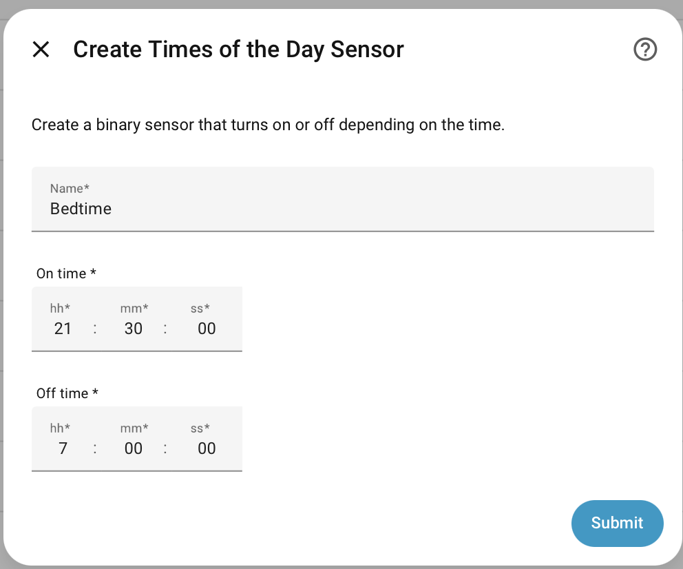

---
tags:
  - scenario
  - recipe
  - condition
title: Bedtime Notifications
description: Define a bed-time condition suitable for the inhabitants of a house and use this to customize notifications from Home Assistant using Supernotify
---
# Recipe - Bedtime

## Purpose

Regardless of where the sun is in the sky, my bed times stay much the same, so
use this in working out how to make notifications, and don't disturb me!

## Implementation

Uses a **Scenario** condition based on time of day. This can then be referred to in the `require_scenarios` section of the notify action `data`, or in template logic.

## Example Configuration

```yaml
scenarios:
  bedtime:
        conditions:
          - condition: time
            alias: Usual bedtime
            after: "21:30:00"
            before: "06:30:00"
```

## Variations

- Use date ranges to alter times across the year
- Define the opposite of bedtime, and use that to allow only notifications then
- Create a [Times of the Day](https://www.home-assistant.io/integrations/tod/) or [Workday](https://www.home-assistant.io/integrations/workday/) binary sensor from **Settings > Devices & services > Helpers** page.

```yaml
scenarios:
  bedtime:
        conditions:
          - condition: state
            entity_id: binary_sensor.bedtime
            state: "on"
```


